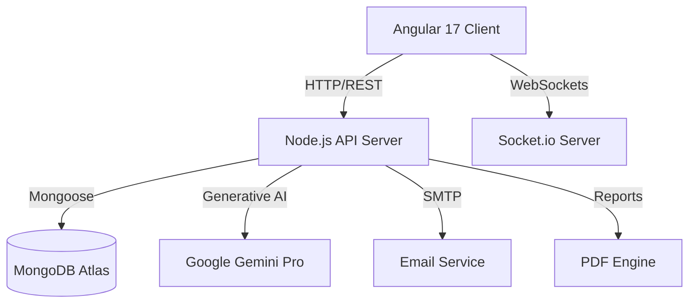

# 🐛 BugSquash CI — AI-Powered QA Test Management Platform


> **The next generation of QA management.** BugSquash CI is a production-grade, full-stack platform that leverages **Generative AI** to streamline test documentation, execution, and analysis.

[](https://github.com/sohaibAkhlaq/bug-squash-ci)
[](LICENSE)
[](#-technology-stack)
[](#-ai-powered-features)

---

## 📋 Overview

**BugSquash CI** is designed for modern engineering teams. Built with the **MEAN stack** (MongoDB, Express.js, Angular 17, Node.js), it provides a high-performance environment for managing test cases, tracking executions in real-time, and generating professional QA reports.

### ✨ What makes it Unique?
Unlike traditional test managers, BugSquash CI is **AI-First**. It uses Google's Gemini Pro to assist engineers in writing better tests and analyzing failures automatically.

---

## 🤖 AI-Powered Features

### 1. Smart Test Case Generator (AI Magic)
*   **Problem**: Writing detailed test steps is time-consuming.
*   **Solution**: Enter a brief title (e.g., *"SSO Login via GitHub"*) and click **AI Magic**.
*   **Impact**: Gemini automatically generates a professional description, sets priority/type, and writes **step-by-step instructions** with expected results.

### 2. Intelligent Failure Analysis
*   **Problem**: Understanding why a CI/CD run failed requires manual log digging.
*   **Solution**: The backend `AIService` analyzes execution logs and suggests the **Root Cause** and a **Potential Fix** instantly.

---

## 💎 Premium Features

- **📊 Real-Time Dashboard** — Instant metrics updates via **Socket.io**.
- **📄 Professional PDF Reports** — Export your test inventory into high-quality PDF reports for stakeholders.
- **✉️ Automated Notifications** — Nodemailer integration for team alerts on test updates.
- **🔐 Enterprise Security** — JWT-based Auth, Role-Based Access Control (RBAC), and Account Lockout protection.
- **🎨 Elite UI/UX** — High-contrast design, glassmorphism effects, and smooth micro-animations.

---

## 🛠 Technology Stack

| Layer | Technology |
|-------|-----------|
| **Frontend** | Angular 17, Tailwind CSS, Chart.js, Socket.io-client |
| **Backend** | Node.js, Express.js, Socket.io, Nodemailer |
| **AI Engine** | Google Gemini 1.5 Flash |
| **Database** | MongoDB with Mongoose ODM |
| **DevOps** | Docker, Nginx, GitHub Actions |

---

## 🚀 Quick Start

### 1. Prerequisites
- **Node.js** 18+ & **MongoDB** 7+
- **Google Gemini API Key** (Get it free at [Google AI Studio](https://aistudio.google.com/))

### 2. Installation

```bash
# Clone the repository
git clone https://github.com/sohaibAkhlaq/bug-squash-ci.git
cd bug-squash-ci

# Setup Backend
cd server
npm install
# Add GEMINI_API_KEY to your .env
npm run dev

# Setup Frontend
cd ../client
npm install --legacy-peer-deps
ng serve
```

---

## 🔑 Demo Credentials

| Role | Email | Password |
|------|-------|----------|
| **Admin** | `admin@bugsquash.com` | `Admin123` |
| **QA Engineer** | `sarah@bugsquash.com` | `Sarah123` |

> **Note**: Run `npm run seed` in the server directory to populate your database with these accounts.

---

## 📊 Project Architecture



---

## 👤 Author

**Sohaib Akhlaq**  
*Full-Stack Engineer *

- GitHub: [@sohaibAkhlaq](https://github.com/sohaibAkhlaq)
- LinkedIn: [Sohaib Akhlaq](https://linkedin.com/in/sohaibakhlaq-fast)

---

## 📄 License

This project is licensed under the MIT License — see the [LICENSE](LICENSE) file for details.
